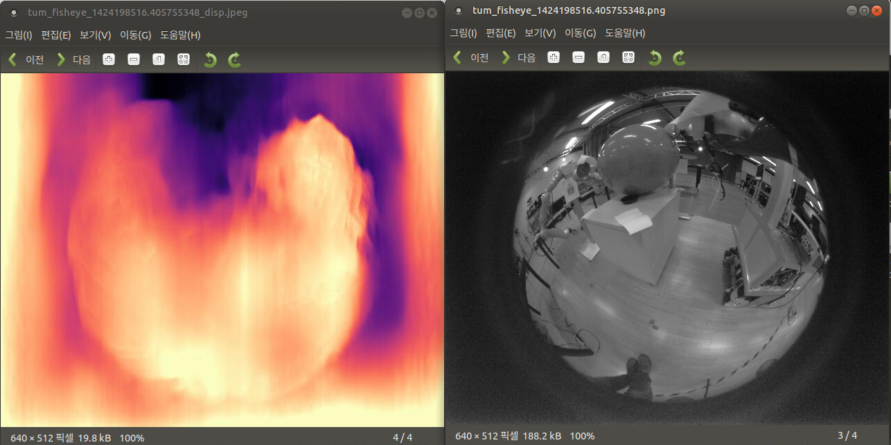

# 240204T
> Eunhyeok Kwon

* download [승용 자율주행차 주간 도심도로 데이터](https://aihub.or.kr/aihubdata/data/view.do?currMenu=115&topMenu=100&dataSetSn=71621)
    * signup/login and request for data access
    * tried installing downloader program but it didn't work
    * used AI Hub shell program
        * bash ./aihubshell -aihubid <id> -aihubpw <pw> -l

* folder structure is roughly like below
```
088.승용_자율주행차_주간_도심도로_데이터
└── 01-1.정식개방데이터
    ├── Training
    │   ├── 01.원천데이터
    │   │   ├── ...
    │   │   └── TS
    │   │       ├── ...
    │   │       └── 22_111309_220623
    │   │           ├── ...
    │   │           └── sensor_raw_data
    │   │               ├── camera
    │   │               ├── camera_leftfront
    │   │               ├── camera_leftrear
    │   │               └── ...
    │   ├── 02.라벨링데이터
    │   │   └── ...
    │   └── #########.jpg
    ├── Other
    │   └── ...
    └── Validation
        └── ...
```

## Train command line

> `python train.py --model_name ai_hub_mono_model_camera --data_path /media/cgv/f9dacde2-bd46-4e02-858d-ef0977ddf2a2/088.승용_자율주행차_주간_도심도로_데이터/01-1.정식개방데이터/Training/01.원천데이터/TS --log_dir /media/cgv/f9dacde2-bd46-4e02-858d-ef0977ddf2a2/models --dataset my --width 1920 --height 1056 --split my --batch_size 4`

* Notes
    * input image width and height needs to be set to integer divisible by 32
        * the comments in the original code says that it resizes the images in the preprocessing stage
    * batch size is 12 by default but it's reduced to 4 because my training data is much larger than the KITTI dataset and GPU memory ran out
        * need to check if this 
    * Must set the K intrinsic value in the `my_dataset.py`
    * There is a line `self.full_res_shape = (1920, 1080)` right below intrinsic variable `K`. Not sure where this is used

 
 * While trying to start training, "Permission denied" error came up.
 * adding `sudo` in front of the command drived different error.
 * to solve the issue add user to the group of the file and give write permission to all the files
 ```
    sudo chgrp -R cgv <directory>
    suro chmod -R g+w <directory>
 ```

* edited `create_split_file.py` (line 58) and `my_dataset.py` (line 55) to train on the dataset downloaded on ai hub
* + need to set device to `cuda:<N>` in `trainer.py` where `<N>` is the GPU id
* + need to do `f_str = "{}_leftrear_{:02}{}".format(folder, frame_index, self.img_ext)` in `my_dataset.py`
    * ai_hub_mono_model_camera -> camera
    * ai_hub_mono_model_camera_leftrear -> camera_leftrear
    * ai_hub_mono_model_camera_leftfront -> camera_leftfront

```
    /home/cgv/anaconda3/envs/monodepth22/lib/python3.6/site-packages/torch/optim/lr_scheduler.py:134: UserWarning: Detected call of `lr_scheduler.step()` before `optimizer.step()`. In PyTorch 1.1.0 and later, you should call them in the opposite order: `optimizer.step()` before `lr_scheduler.step()`.  Failure to do this will result in PyTorch skipping the first value of the learning rate schedule. See more details at https://pytorch.org/docs/stable/optim.html#how-to-adjust-learning-rate
    
    "https://pytorch.org/docs/stable/optim.html#how-to-adjust-learning-rate", UserWarning)
    
    Training
    
    /home/cgv/anaconda3/envs/monodepth22/lib/python3.6/site-packages/torch/nn/functional.py:4004: UserWarning: Default grid_sample and affine_grid behavior has changed to align_corners=False since 1.3.0. Please specify align_corners=True if the old behavior is desired. See the documentation of grid_sample for details.
    
    "Default grid_sample and affine_grid behavior has changed "
```
* This error says that I should change the pytorch version to 1.1.0 > ; or I should change the code
* also default setting related to grid has changed since 1.3.0
* Currently, I'm using torch version 1.10.2
* This should be changed to 1.0.9 or lower


# 240207W
> Eunhyeok Kwon
* training on 1920x1080 sized images takes long time.
    * The estimated time was displayed to be 150 hours but about 16 hours have passed for the estimated time to reach 100 hours
    * Seems like it will take roughly 48 hours == 2 full days

* To check the progess of the model training, I copied the weight1 model data and ran the test
* Larger model takes significantly longer time to test the video
    * To run the monodepth model with least computational load, the training image should be resized or the model should be compressed

* Resizing training dataset is necessary
    * Need to find out if camera intrinsic values are affected when images are resized


* 결과 너무 이상한데, K 값 normalize하는 것 찾아보기


`python train.py --model_name my_kitti --data_path /media/cgv/f9dacde2-bd46-4e02-858d-ef0977ddf2a2/kitti_data/data --log_dir /media/cgv/f9dacde2-bd46-4e02-858d-ef0977ddf2a2/models --dataset my --width 1216 --height 352 --split my --batch_size 12`

# 240213T
> Taemin Lee

* Update the my_dataset.py
    * change the K matrix (normalization)
    * width: 1920, height: 1080 (AI Hub Camera front images size)
    * first row / width, second row / height
    * ` python train.py --model_name ai_hub_mono_model_camera --data_path /media/cgv/f9dacde2-bd46-4e02-858d-ef0977ddf2a2/088.승용_자율주행차_주간_도심도로_데이터/01-1.정식개방데이터/Training/01.원천데이터/TS --log_dir /media/cgv/f9dacde2-bd46-4e02-858d-ef0977ddf2a2/models --dataset my --width 1920 --height 1056 --split my --batch_size 4 --num_epochs 1`
        * estimated 7 hours
        * stopped training because wanted to test if resizing works too

* 모델 이름 만드는 규칙
    * `<데이터 셋>_<width>x<height>_<other>_v<#>`
        * can skip `<other>` part

* Sizes for AI-HUB dataset
    * 1920x1088
        * 960x544
        * 480x272
    * 1920x1056
        * 640x352

* Training
    * `python train.py --model_name aihub_640x352_camera_v1 --data_path /media/cgv/f9dacde2-bd46-4e02-858d-ef0977ddf2a2/088.승용_자율주행차_주간_도심도로_데이터/01-1.정식개방데이터/Training/01.원천데이터/TS --log_dir /media/cgv/f9dacde2-bd46-4e02-858d-ef0977ddf2a2/models --dataset my --width 640 --height 352 --split my --batch_size 12 --num_epochs 20`
    * removed `self.full_res_shape = (1242, 375)` from `my_dataset.py` to see if training still works without this line
    * So this is testing 3 things
        1. If camera intrinsic normalization works
        2. If assigned width and height works
        3. if `self.full_res_shape` is not needed when training

* Fish eye datasets
    * found some useful dataset from [OmniCV WorkshopCVPR2020](https://sites.google.com/view/omnicv-cvpr2020/useful-datasets)

        * [Friedrich-Alexander-Universität Fisheye Data Set](https://www.lms.tf.fau.eu/research/downloads/fisheye-data-set/)
            * Download doesn't work
        * [Large-Scale Direct SLAM for Omnidirectional Cameras](https://cvg.cit.tum.de/data/datasets/omni-lsdslam)
            * Download works and it also has GT data
            * made by TUM

* Test TUM fish eye dataset
    * `python test_simple.py --model_name mono_640x192 --image_path assets/tum_fisheye_1424198516.405755348.png --out assets`
    * The result is bad. It is not able to process any depth features
    * 

* Test with normalized and resized model trained with AI HUB dataset
    * weights_0
        * `python test_video.py --model_name aihub_640x352_camera_v1_weights_0 --file_name oseok.mp4`
        * result:
        * 
        * Something is not quite right...
        * Training is continued but seems like some change is needed

* TODO
    * model path도 arg로 입력 받을 수 있도록 코드 추가
    * 모델 여러개 동시에 학습하는게 안됐었는데 width, height 작게 arg로 줘서 돌리면 여러개 동시 학습 가능할 것 같음
        * 근데 cpu는 상당히 많이 사용하고 있어서 안될 수도 있는데 한번 테스트 해봐야 할듯 