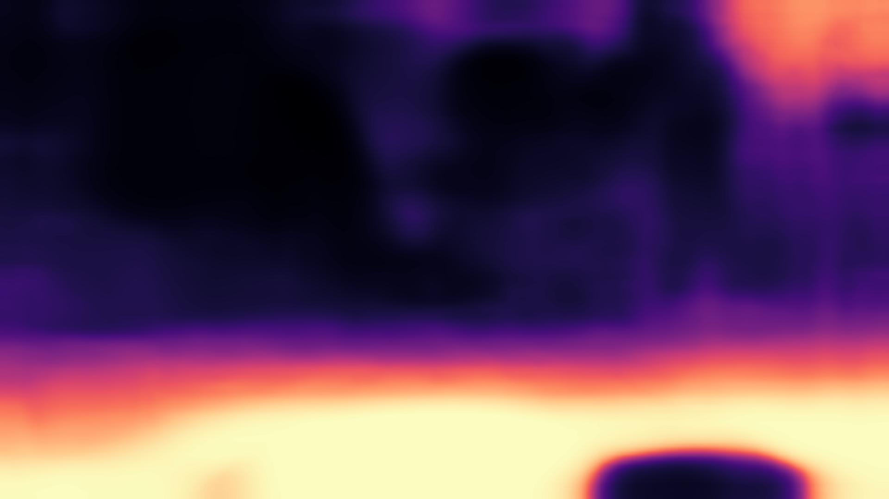

# Progress Log

## 240204TTS
>
> Eunhyeok Kwon

* download [승용 자율주행차 주간 도심도로 데이터](https://aihub.or.kr/aihubdata/data/view.do?currMenu=115&topMenu=100&dataSetSn=71621)
  * signup/login and request for data access
  * tried installing downloader program but it didn't work
  * used AI Hub shell program
    * bash ./aihubshell -aihubid \<id> -aihubpw \<pw> -l

* folder structure is roughly like below

```text
088.승용_자율주행차_주간_도심도로_데이터
└── 01-1.정식개방데이터
    ├── Training
    │   ├── 01.원천데이터
    │   │   ├── ...
    │   │   └── TS
    │   │       ├── ...
    │   │       └── 22_111309_220623
    │   │           ├── ...
    │   │           └── sensor_raw_data
    │   │               ├── camera
    │   │               ├── camera_leftfront
    │   │               ├── camera_leftrear
    │   │               └── ...
    │   ├── 02.라벨링데이터
    │   │   └── ...
    │   └── #########.jpg
    ├── Other
    │   └── ...
    └── Validation
        └── ...
```

## Train command line

> `python train.py --model_name ai_hub_mono_model_camera --data_path /media/cgv/f9dacde2-bd46-4e02-858d-ef0977ddf2a2/088.승용_자율주행차_주간_도심도로_데이터/01-1.정식개방데이터/Training/01.원천데이터/TS --log_dir /media/cgv/f9dacde2-bd46-4e02-858d-ef0977ddf2a2/models --dataset my --width 1920 --height 1056 --split my --batch_size 4`

* Notes
  * input image width and height needs to be set to integer divisible by 32
    * the comments in the original code says that it resizes the images in the preprocessing stage
  * batch size is 12 by default but it's reduced to 4 because my training data is much larger than the KITTI dataset and GPU memory ran out
    * need to check if this
  * Must set the K intrinsic value in the `my_dataset.py`
  * There is a line `self.full_res_shape = (1920, 1080)` right below intrinsic variable `K`. Not sure where this is used

* While trying to start training, "Permission denied" error came up.
* adding `sudo` in front of the command drived different error.
* to solve the issue add user to the group of the file and give write permission to all the files

 ```bash
    sudo chgrp -R cgv <directory>
    sudo chmod -R g+w <directory>
 ```

* edited `create_split_file.py` (line 58) and `my_dataset.py` (line 55) to train on the dataset downloaded on ai hub
* need to set device to `cuda:<N>` in `trainer.py` where `<N>` is the GPU id
* need to do `f_str = "{}_leftrear_{:02}{}".format(folder, frame_index, self.img_ext)` in `my_dataset.py`
  * ai_hub_mono_model_camera -> camera
  * ai_hub_mono_model_camera_leftrear -> camera_leftrear
  * ai_hub_mono_model_camera_leftfront -> camera_leftfront

```text
    /home/cgv/anaconda3/envs/monodepth22/lib/python3.6/site-packages/torch/optim/lr_scheduler.py:134: UserWarning: Detected call of `lr_scheduler.step()` before `optimizer.step()`. In PyTorch 1.1.0 and later, you should call them in the opposite order: `optimizer.step()` before `lr_scheduler.step()`.  Failure to do this will result in PyTorch skipping the first value of the learning rate schedule. See more details at https://pytorch.org/docs/stable/optim.html#how-to-adjust-learning-rate
    
    "https://pytorch.org/docs/stable/optim.html#how-to-adjust-learning-rate", UserWarning)
    
    Training
    
    /home/cgv/anaconda3/envs/monodepth22/lib/python3.6/site-packages/torch/nn/functional.py:4004: UserWarning: Default grid_sample and affine_grid behavior has changed to align_corners=False since 1.3.0. Please specify align_corners=True if the old behavior is desired. See the documentation of grid_sample for details.
    
    "Default grid_sample and affine_grid behavior has changed "
```

* This error says that I should change the pytorch version to 1.1.0 > ; or I should change the code
* also default setting related to grid has changed since 1.3.0
* Currently, I'm using torch version 1.10.2
* This should be changed to 1.0.9 or lower

## 240207W
>
> Eunhyeok Kwon

* training on 1920x1080 sized images takes long time.
  * The estimated time was displayed to be 150 hours but about 16 hours have passed for the estimated time to reach 100 hours
  * Seems like it will take roughly 48 hours == 2 full days

* To check the progess of the model training, I copied the weight1 model data and ran the test
* Larger model takes significantly longer time to test the video
  * To run the monodepth model with least computational load, the training image should be resized or the model should be compressed

* Resizing training dataset is necessary
  * Need to find out if camera intrinsic values are affected when images are resized

* aihub 데이터셋으로 학습한 결과 너무 이상한데, K 값 normalize하는 것 찾아보기

`python train.py --model_name my_kitti --data_path /media/cgv/f9dacde2-bd46-4e02-858d-ef0977ddf2a2/kitti_data/data --log_dir /media/cgv/f9dacde2-bd46-4e02-858d-ef0977ddf2a2/models --dataset my --width 1216 --height 352 --split eigen_zhou --batch_size 12`

`python test_video.py --model_name my_kitti_weights_19 --file_name parking.mp4`

## 240213T
>
> Taemin Lee

* Update the my_dataset.py
  * change the K matrix (normalization)
  * width: 1920, height: 1080 (AI Hub Camera front images size)
  * first row / width, second row / height
  * `python train.py --model_name ai_hub_mono_model_camera --data_path /media/cgv/f9dacde2-bd46-4e02-858d-ef0977ddf2a2/088.승용_자율주행차_주간_도심도로_데이터/01-1.정식개방데이터/Training/01.원천데이터/TS --log_dir /media/cgv/f9dacde2-bd46-4e02-858d-ef0977ddf2a2/models --dataset my --width 1920 --height 1056 --split my --batch_size 4 --num_epochs 1`
    * estimated 7 hours
    * stopped training because wanted to test if resizing works too

* 모델 이름 만드는 규칙
  * `<데이터 셋>_<width>x<height>_<other>_v<#>`
    * can skip `<other>` part

* Sizes for AI-HUB dataset
  * 1920x1088
    * 960x544
    * 480x272
  * 1920x1056
    * 640x352

* Training
  * `python train.py --model_name aihub_640x352_camera_v1 --data_path /media/cgv/f9dacde2-bd46-4e02-858d-ef0977ddf2a2/088.승용_자율주행차_주간_도심도로_데이터/01-1.정식개방데이터/Training/01.원천데이터/TS --log_dir /media/cgv/f9dacde2-bd46-4e02-858d-ef0977ddf2a2/models --dataset my --width 640 --height 352 --split my --batch_size 12 --num_epochs 20`
  * removed `self.full_res_shape = (1242, 375)` from `my_dataset.py` to see if training still works without this line
  * So this is testing 3 things
        1. If camera intrinsic normalization works
        2. If assigned width and height works
        3. if `self.full_res_shape` is not needed when training
            * This is used in `get_depth` (getting GT) function

* Fish eye datasets
  * found some useful dataset from [OmniCV WorkshopCVPR2020](https://sites.google.com/view/omnicv-cvpr2020/useful-datasets)

    * [Friedrich-Alexander-Universität Fisheye Data Set](https://www.lms.tf.fau.eu/research/downloads/fisheye-data-set/)
      * Download doesn't work
    * [Large-Scale Direct SLAM for Omnidirectional Cameras](https://cvg.cit.tum.de/data/datasets/omni-lsdslam)
      * Download works and it also has GT data
      * made by TUM

* Test TUM fish eye dataset
  * `python test_simple.py --model_name mono_640x192 --image_path assets/tum_fisheye_1424198516.405755348.png --out assets`
  * The result is bad. It is not able to process any depth features
  * 

* Test with normalized and resized model trained with AI HUB dataset
  * weights_0
    * `python test_video.py --model_name aihub_640x352_camera_v1_weights_0 --file_name oseok.mp4`
    * result:
    * 
    * Something is not quite right...
    * Training is continued but seems like some change is needed

* TODO
  * model path도 arg로 입력 받을 수 있도록 코드 추가
  * 모델 여러개 동시에 학습하는게 안됐었는데 width, height 작게 arg로 줘서 돌리면 여러개 동시 학습 가능할 것 같음
  * 용곤님과 연락해서 우리가 사용하려고 하는 fish eye 데이터 셋에 대해 정보를 더 얻어낼 필요가 있어 보임

## 240314W

* ["GO Stanford" Dataset](https://cvgl.stanford.edu/gonet/dataset/)
  * Whole Dataset - Training Data

  * `python test_simple.py --model_name mono_640x192 --image_path assets/GO_Stanford_img_build14_8851_L.jpg --out assets`
    * result
        *

* Notes
  * 컬러 fish eye 이미지로 해도 깊이 추정 전혀 안됨. 저화질 또는 이미지 주변에 검정색 테두리 때문일 가능성 있음
  * 연구 목적이 정확히 어떤 것인지 조금 불명확함
    * Fish eye 이미지에서 깊이 추정을 잘 하고 싶은 것인지
    * 블랙박스 데이터 셋을 사용해 비지도 학습을 시키고 싶은 것인지
    * 1번인 것 같긴 한데 그럼 왜 Monodepth2에 집착하고 우리가 찍은 영상으로 테스트를 계속 시도하는 것인지, fish eye카메라도 아닌데 ??

* 일반 이미지를 gray scale로 변환해서 테스트 해봄
  * `python test_simple.py --model_name mono_640x192 --image_path assets/test_image_gray.jpg --out assets`

* gif 만드는 command
  * `ffmpeg -i <video file> -vf "fps=10,scale=320:-1:flags=lanczos,split[s0][s1];[s0]palettegen[p];[s1][p]paletteuse" -loop 0 <output file name>.gif`

* Dataset image size
  * KITTI: 1242x375
  * AI Hub:  1920x1080
  * test image: 638x235

* 발표 피드백
  * 굳이 monodepth2를 사용할 필요 없음 fish eye 잘 되기만 하면 됨
  * 임베디드에서 돌아가야 됨 -> 따라서 work load 최소화 해야 됨?
    * 아무튼 fish eye image rectification 또는 cube map 형식으로 만들어서 작업하는 것은 안됨

## 240215R

* AI HUB dataset trainig
  * tried training with only images that are taken in "맑음" weather
  * changed `create_split_file.py` for this
  * `python train.py --model_name aihub_640x352_camera_v2 --data_path /media/cgv/f9dacde2-bd46-4e02-858d-ef0977ddf2a2/088.승용_자율주행차_주간_도심도로_데이터/01-1.정식개방데이터/Training/01.원천데이터/TS --log_dir /media/cgv/f9dacde2-bd46-4e02-858d-ef0977ddf2a2/models --dataset my --width 640 --height 352 --split my --batch_size 12 --num_epochs 20`

  * `python test_video.py --model_name aihub_640x352_camera_v2_weights_3 --file_name parking.mp4`

  * kitti data set 크기로 잘라서 학습 시켜보기
    * 근데 이렇게 하면 camera intrinsic 달라져서 안될 것 같다
    * 방법이 아닌 것 같다

## 240216F

* 교수님 said
  * 모델 사이즈가 640x192면 테스트 하는 이미지도 이 사이즈여야 하는거 아니냐
  * 근데 나는 모델 사이즈와 테스트 이미지와의 관계가 크게 상관 없다고 생각
  * 이것을 확인해 보기 위해서 세로로 길다란 이미지를 입력으로 사용해서 테스트 해본다
    * `python test_simple.py --model_name mono_640x192 --image_path assets/unsplash_1.jpg --out assets`
* 테스트와는 별개로 학습 시킬 때는 모델 사이즈가..?

* preprocessing on the images before forwarded to pose network
    *
* smoothness term ??
* drop down?
  * 1e-4 learning rate for the first 15 epochs and then 1e-5 learning rate for 5 epochs
  * this is chosen based on 10% of the validation set. Refering to a paper on Adam optimization

## 240219M

* 논문에 나온 "Wander" 데이터셋은 못 찾겠다
* 논문에 보면 "We use an input/output resolution of 128×224." 라고 나와있어서 나도 크기를 많이 줄여서 다시 테스트 해 봐야겠다
  * 논문에서 잘못 적은 것 같다. 224x128이 맞을듯
* `python train.py --model_name aihub_224x128_camera_v1 --data_path /media/cgv/f9dacde2-bd46-4e02-858d-ef0977ddf2a2/088.승용_자율주행차_주간_도심도로_데이터/01-1.정식개방데이터/Training/01.원천데이터/TS --log_dir /media/cgv/f9dacde2-bd46-4e02-858d-ef0977ddf2a2/models --dataset my --width 224 --height 128 --split my --batch_size 12 --num_epochs 15 --learning_rate 1e-4`

* run_epoch
  * run a single epoch of training and validation
  * 여기서 각 epoch당 loss를 plot해볼 수 있을 것 같다
  * 내부적으로 for loop를 통해 batch를 돌리고 있어서 batch당 loss를 보여줄 수도 있을 것 같다

* 다음 발표까지 해볼 것
  * loss 그래프로 출력하기
  * fisheye 데이터 셋 찾아서 학습 시켜보기

* CGV 서버 컴에서는 pytorch 1.1.0 이상만 작동 한다

* `python train.py --model_name my_kitti --data_path /media/cgv/f9dacde2-bd46-4e02-858d-ef0977ddf2a2/kitti_data/data --log_dir /media/cgv/f9dacde2-bd46-4e02-858d-ef0977ddf2a2/models --dataset kitti --width 1216 --height 352 --split eigen_zhou --batch_size 12 --num_epochs 15 --learning_rate 1e-4`

## 240306W

* 발표를 위해 loss 곡선을 그려본다
  * loss 곡선 코드는 `trainer.py`에 있다

* aihub_224x128_camera_v2
  * `python train.py --model_name aihub_224x128_camera_v2 --data_path /media/cgv/f9dacde2-bd46-4e02-858d-ef0977ddf2a2/088.승용_자율주행차_주간_도심도로_데이터/01-1.정식개방데이터/Training/01.원천데이터/TS --log_dir /media/cgv/f9dacde2-bd46-4e02-858d-ef0977ddf2a2/models --dataset my --width 224 --height 128 --split my --batch_size 12 --num_epochs 15 --learning_rate 1e-4`

* kitti
  * `python train.py --model_name kitti_416x128_v1 --data_path /media/cgv/f9dacde2-bd46-4e02-858d-ef0977ddf2a2/kitti_data/data --log_dir /media/cgv/f9dacde2-bd46-4e02-858d-ef0977ddf2a2/models --dataset kitti --width 416 --height 128 --split eigen_zhou --batch_size 12 --num_epochs 15 --learning_rate 1e-4`

## 240309S

* 250 batch당 train과 validation loss 곡선 그리기 다시 시도
  * `python train.py --model_name kitti_416x128_v1 --data_path /media/cgv/f9dacde2-bd46-4e02-858d-ef0977ddf2a2/kitti_data/data --log_dir /media/cgv/f9dacde2-bd46-4e02-858d-ef0977ddf2a2/models --dataset kitti --width 416 --height 128 --split eigen_zhou --batch_size 12 --num_epochs 15 --learning_rate 1e-4`

* ai hub 데이터 셋을 다시 학습 시켜 보는데 `create_split_file.py` 부분에서 아래 조건을 걸고 했다

    ```python
    if not check_word_in_line(f'{folder}/{folder}_meta_data.json', 'DN8', 2):
            continue
    ```

  * `python train.py --model_name aihub_224x128_camera_v2 --data_path /media/cgv/f9dacde2-bd46-4e02-858d-ef0977ddf2a2/088.승용_자율주행차_주간_도심도로_데이터/01-1.정식개방데이터/Training/01.원천데이터/TS --log_dir /media/cgv/f9dacde2-bd46-4e02-858d-ef0977ddf2a2/models --dataset my --width 224 --height 128 --split my --batch_size 12 --num_epochs 15 --learning_rate 1e-4`

* 현재 250 batch마다 training loss를 평균 낸 값을 plot 하고 있고 validation loss는 그냥 250 batch마다 한번 돌려서 plot 하고 있다
  * 그래서 training loss의 커브는 자연스러운 곡선을 그리고 validation loss는 값이 많이 튀는 것 처럼 보이는 것이다

* DN8 데이터로만 학습을 시키니까 loss가 학습을 반복함에 따라 낮아지는 것을 확인 할 수 있었다.
  * 한번 테스트 해 보기
  * 테스트 하려면 일단 models로 파일을 옮겨야 한다
  * `cp /media/cgv/f9dacde2-bd46-4e02-858d-ef0977ddf2a2/models/aihub_224x128_camera_v2/models/weights_6 ~/DepthEstimation/monodepth2/models/aihub_224x128_camera_v2_weights_6 -r`
  * `python test_simple.py --model_name aihub_224x128_camera_v2_weights_6 --image_path /media/cgv/f9dacde2-bd46-4e02-858d-ef0977ddf2a2/088.승용_자율주행차_주간_도심도로_데이터/01-1.정식개방데이터/Training/01.원천데이터/TS/21_195953_220621/sensor_raw_data/camera/21_195953_220621_01.jpg --out assets`

  * kitti로 학습된 모델로도 확인
    * `python test_simple.py --model_name kitti_mono_model --image_path /media/cgv/f9dacde2-bd46-4e02-858d-ef0977ddf2a2/088.승용_자율주행차_주간_도심도로_데이터/01-1.정식개방데이터/Training/01.원천데이터/TS/21_195953_220621/sensor_raw_data/camera/21_195953_220621_01.jpg --out assets`

  * 테스트 결과
    * 
    * 

## 240310U

* kitti 모델의 weights_6도 확인을 해 보자
  * `cp /media/cgv/f9dacde2-bd46-4e02-858d-ef0977ddf2a2/models/my_kitti/models/weights_6 ~/DepthEstimation/monodepth2/models/my_kitti_weights_6 -r`
  * `python test_simple.py --model_name my_kitti_weights_6 --image_path /media/cgv/f9dacde2-bd46-4e02-858d-ef0977ddf2a2/088.승용_자율주행차_주간_도심도로_데이터/01-1.정식개방데이터/Training/01.원천데이터/TS/21_195953_220621/sensor_raw_data/camera/21_195953_220621_01.jpg --out assets`
  * 테스트 결과
    * 

* AI hub데이터 셋은 너무 별로라는 결론이 나왔다
  * [데이터 셋 검색할 수 있는 사이트 목록](https://kr.appen.com/blog/best-datasets/)
  * 이 중 구글 데이터 셋 검색엔진에서 "driving"이라고 검색어를 입력하여 찾아 보았다 [검색 링크](https://datasetsearch.research.google.com/search?src=0&query=driving&docid=L2cvMTFocmd2bjM3cw%3D%3D)
    * 2021년도에 제작된 Boreas Autonomous Driving Dataset을 찾았다
    * [github download instruction](https://github.com/utiasASRL/pyboreas/blob/master/download.md)
    * [web download](https://www.boreas.utias.utoronto.ca/#/download)

    * aws cli를 다운 받았다. 아래와 같이 사용 할 수 있다
      * `aws --version`

        ```text
            root=/media/cgv/f9dacde2-bd46-4e02-858d-ef0977ddf2a2/
            sequence=boreas-2021-05-06-13-19
            aws s3 sync s3://boreas/$sequence $root$sequence --no-sign-request
        ```

    * 웹사이트에서는 Camera만 따로 다운로드 받는 옵션을 선택할 수 있는데 aws cli를 사용해서는 따로 하는 방법이 안내가 안되어 있다

## 240313W

* boreas 데이터 셋의 data 폴더 안에 있는 png 파일들 jpg로 변환
* `find /media/cgv/f9dacde2-bd46-4e02-858d-ef0977ddf2a2/boreas-2021-05-06-13-19/camera  -name '*.png' | parallel 'convert -quality 92 -sampling-factor 2x2,1x1,1x1 {.}.png {.}.jpg && rm {}'`
* my_dataset.py 카메라 intrinsic 수정 (이미 normalized 값이어서 그냥 사용함.)

## 240320W

* KITTI dataset
  * city 28
  * residential 21
  * road 12
  * campus 10
    * 교내 주행 영상이라서 사람, 자전거, 다양한 형태의 물체들이 영상에 등장한다
  * person 80
    * 카메라가 벽을 바라보도록 고정 시켜 놓은 다음 사람들이 왔다갔다 하는 영상들
  * calibration 5
    * camera calibration을 위한 체커 보드 영상들

    ```text
        .
        ├── ./2011_09_26_calib.zip
        ├── ./2011_09_26_drive_0001_sync.zip
        ├── ./2011_09_26_drive_0002_sync.zip
        ├── ./2011_09_26_drive_0005_sync.zip
        ├── ./2011_09_26_drive_0009_sync.zip
        ├── ./2011_09_26_drive_0011_sync.zip
        ├── ./2011_09_26_drive_0013_sync.zip
        ├── ./2011_09_26_drive_0014_sync.zip
        ├── ./2011_09_26_drive_0015_sync.zip
        ├── ./2011_09_26_drive_0017_sync.zip
        ├── ./2011_09_26_drive_0018_sync.zip
        ├── ./2011_09_26_drive_0019_sync.zip
        ├── ./2011_09_26_drive_0020_sync.zip
        ├── ./2011_09_26_drive_0022_sync.zip
        ├── ./2011_09_26_drive_0023_sync.zip
        ├── ./2011_09_26_drive_0027_sync.zip
        ├── ./2011_09_26_drive_0028_sync.zip
        ├── ./2011_09_26_drive_0029_sync.zip
        ├── ./2011_09_26_drive_0032_sync.zip
        ├── ./2011_09_26_drive_0035_sync.zip
        ├── ./2011_09_26_drive_0036_sync.zip
        ├── ./2011_09_26_drive_0039_sync.zip
        ├── ./2011_09_26_drive_0046_sync.zip
        ├── ./2011_09_26_drive_0048_sync.zip
        ├── ./2011_09_26_drive_0051_sync.zip
        ├── ./2011_09_26_drive_0052_sync.zip
        ├── ./2011_09_26_drive_0056_sync.zip
        ├── ./2011_09_26_drive_0057_sync.zip
        ├── ./2011_09_26_drive_0059_sync.zip
        ├── ./2011_09_26_drive_0060_sync.zip
        ├── ./2011_09_26_drive_0061_sync.zip
        ├── ./2011_09_26_drive_0064_sync.zip
        ├── ./2011_09_26_drive_0070_sync.zip
        ├── ./2011_09_26_drive_0079_sync.zip
        ├── ./2011_09_26_drive_0084_sync.zip
        ├── ./2011_09_26_drive_0086_sync.zip
        ├── ./2011_09_26_drive_0087_sync.zip
        ├── ./2011_09_26_drive_0091_sync.zip
        ├── ./2011_09_26_drive_0093_sync.zip
        ├── ./2011_09_26_drive_0095_sync.zip
        ├── ./2011_09_26_drive_0096_sync.zip
        ├── ./2011_09_26_drive_0101_sync.zip
        ├── ./2011_09_26_drive_0104_sync.zip
        ├── ./2011_09_26_drive_0106_sync.zip
        ├── ./2011_09_26_drive_0113_sync.zip
        ├── ./2011_09_26_drive_0117_sync.zip
        ├── ./2011_09_28_calib.zip
        ├── ./2011_09_28_drive_0001_sync.zip
        ├── ./2011_09_28_drive_0002_sync.zip
        ├── ./2011_09_29_calib.zip
        ├── ./2011_09_29_drive_0004_sync.zip
        ├── ./2011_09_29_drive_0026_sync.zip
        ├── ./2011_09_29_drive_0071_sync.zip
        ├── ./2011_09_30_calib.zip
        ├── ./2011_09_30_drive_0016_sync.zip
        ├── ./2011_09_30_drive_0018_sync.zip
        ├── ./2011_09_30_drive_0020_sync.zip
        ├── ./2011_09_30_drive_0027_sync.zip
        ├── ./2011_09_30_drive_0028_sync.zip
        ├── ./2011_09_30_drive_0033_sync.zip
        ├── ./2011_09_30_drive_0034_sync.zip
        ├── ./2011_10_03_calib.zip
        ├── ./2011_10_03_drive_0027_sync.zip
        ├── ./2011_10_03_drive_0034_sync.zip
        ├── ./2011_10_03_drive_0042_sync.zip
        ├── ./2011_10_03_drive_0047_sync.zip
    ```

  * KITTI dataset에 종류가 많긴 한데 그 종류라는 것은 사실 많은 영상들을 구분해 놓은 분류체계에 더 가깝고 현재 monodepth2는 괜찮은 영상은 전부 사용하고 있다
    * 사용하지 않은 campus 영상은 10개 밖에 없고
    * person영상은 카메라는 고정인데 움직이는 물체가 별로 없어서 효과적이지 않을 것 같고
    * calib도 마찬가지고 학습에 사용하기 어려워 보인다
  * monodept2 논문에서 사용한 KITTI dataset 정보
    * 1242 x 375
    * 61개의 영상 데이터
    * jpeg 형식 컬러 이미지
    * split file
      * train: 39810 (left and right 포함)
      * valid: 4424 (left and right 포함)
      * stereo로 사용할 용도로 left and right 영상이 있는데 둘다 학습에 사용하고 있다
        * 결국 매우 비슷한 사진을 2번씩 학습에 사용하고 있는 것이다

  * AI hub dataset (088.승용_자율주행차_주간_도심도로_데이터)
    * 08, 18, 21, 22 이렇게 4 종류가 있다
      * 각각 촬영한 장소가 다르다
      * 사용한 카메라의 Intrinsic은 같다. Extrinsic은 다르다
    * 1920 x 1080
    *

* boreas 학습 시도
  * 2448 x 2048
    * 384 x 320
  * `python train.py --model_name boreas_384x320_v1 --data_path /media/cgv/f9dacde2-bd46-4e02-858d-ef0977ddf2a2/boreas/2021-05-06-13-19 --log_dir /media/cgv/f9dacde2-bd46-4e02-858d-ef0977ddf2a2/models --dataset boreas --width 384 --height 320 --split boreas_split_1 --batch_size 12 --num_epochs 15 --learning_rate 1e-4`

  * `python test_simple.py --model_name boreas_384x320_v1_weights_0 --image_path ~/DepthEstimation/monodepth2/assets/test_image.jpg --out assets`

## 240324S

* kitti dataset campus
  * `python train.py --model_name kitti_campus_384x320_v1 --data_path /media/cgv/f9dacde2-bd46-4e02-858d-ef0977ddf2a2/kitti_campus/data --log_dir /media/cgv/f9dacde2-bd46-4e02-858d-ef0977ddf2a2/models --dataset kitti_campus --width 384 --height 320 --split kitti_campus --batch_size 12 --num_epochs 15 --learning_rate 1e-4`
    * -> wrong width and height resizing
  * 아래 다시함
  * `python train.py --model_name kitti_campus_640x192_v1 --data_path /media/cgv/f9dacde2-bd46-4e02-858d-ef0977ddf2a2/kitti_campus/data --log_dir /media/cgv/f9dacde2-bd46-4e02-858d-ef0977ddf2a2/models --dataset kitti_campus --width 640 --height 192 --split kitti_campus --batch_size 12 --num_epochs 15 --learning_rate 1e-4`
  * test single image
    * `python test_simple.py --model_name kitti_campus_384x320_v1_weights_14 --image_path assets/test_image.jpg`
    * `python test_simple.py --model_name kitti_campus_640x192_v1_weights_14 --image_path assets/test_image.jpg`

* kitti odom
  * `find kitti_data/ -name '*.png' | parallel 'convert -quality 92 -sampling-factor 2x2,1x1,1x1 {.}.png {.}.jpg && rm {}'`

  * `python train.py --model_name kitti_odom_384x320_v1 --data_path /media/cgv/f9dacde2-bd46-4e02-858d-ef0977ddf2a2/kitti_odom --log_dir /media/cgv/f9dacde2-bd46-4e02-858d-ef0977ddf2a2/models --dataset kitti_odom --width 384 --height 320 --split odom --batch_size 12 --num_epochs 15 --learning_rate 1e-4`
    * -> wrong width and height resizing
  * 아래 다시함
  * `python train.py --model_name kitti_odom_640x192_v1 --data_path /media/cgv/f9dacde2-bd46-4e02-858d-ef0977ddf2a2/kitti_odom --log_dir /media/cgv/f9dacde2-bd46-4e02-858d-ef0977ddf2a2/models --dataset kitti_odom --width 640 --height 192 --split odom --batch_size 12 --num_epochs 15 --learning_rate 1e-4`
  * test
    * `python test_simple.py --model_name kitti_odom_640x192_v1_weights_14 --image_path assets/test_image.jpg`

* Our goal was to find the different tpye of kitti dataset. However, there was no another kitti dataset. Kitti dataset was only categorized. We found out that camus category was not used in monodepth2 training. So we tried using campus category data which was only about 1200 images. The result was better than other datasets but not good as the model trained on eigen-zhou split of kitti raw dataset.

* kitti resize
  * `python train.py --model_name kitti_resize_320x192_v1 --data_path /media/cgv/f9dacde2-bd46-4e02-858d-ef0977ddf2a2/kitti_data/data --log_dir /media/cgv/f9dacde2-bd46-4e02-858d-ef0977ddf2a2/models --dataset kitti_resize --width 320 --height 192 --split kitti_resize --batch_size 12 --num_epochs 15 --learning_rate 1e-4`
  * test
    * `python test_simple.py --model_name kitti_resize_320x192_v1_weights_14 --image_path assets/test_image.jpg`

* aihub88 resize
  * `python train.py --model_name aihub88_resize_640x192_v1 --data_path /media/cgv/f9dacde2-bd46-4e02-858d-ef0977ddf2a2/088.승용_자율주행차_주간_도심도로_데이터/01-1.정식개방데이터/Training/01.원천데이터/TS --log_dir /media/cgv/f9dacde2-bd46-4e02-858d-ef0977ddf2a2/models --dataset aihub88_resize --width 640 --height 192 --split aihub88_split_1 --batch_size 12 --num_epochs 15 --learning_rate 1e-4`
  * test
    * `python test_simple.py --model_name aihub88_resize_640x192_v1_weights_14 --image_path assets/test_image.jpg`

## 240325M

* 오늘 발표 때 사용했던 데이터
  * aihub88_resize_640x192_v1
    * `python train.py --model_name aihub88_resize_640x192_v1 --dataset aihub88_resize --data_path /media/cgv/f9dacde2-bd46-4e02-858d-ef0977ddf2a2/088.승용_자율주행차_주간_도심도로_데이터/01-1.정식개방데이터/Training/01.원천데이터/TS --log_dir /media/cgv/f9dacde2-bd46-4e02-858d-ef0977ddf2a2/models --width 640 --height 192 --split aihub88_split_1 --batch_size 12 --num_epochs 15 --learning_rate 1e-4 --cuda 0`
  * kitti_resize_320x192_v1
    * `python train.py --model_name kitti_resize_320x192_v1 --dataset kitti_resize --data_path /media/cgv/f9dacde2-bd46-4e02-858d-ef0977ddf2a2/kitti_data/data --log_dir /media/cgv/f9dacde2-bd46-4e02-858d-ef0977ddf2a2/models --width 320 --height 192 --split kitti_resize --batch_size 12 --num_epochs 15 --learning_rate 1e-4 --cuda 1`
  * kitti_odom_640x192_v1
    * `python train.py --model_name kitti_odom_640x192_v1 --dataset kitti_odom --data_path /media/cgv/f9dacde2-bd46-4e02-858d-ef0977ddf2a2/kitti_odom --log_dir /media/cgv/f9dacde2-bd46-4e02-858d-ef0977ddf2a2/models --width 640 --height 192 --split odom --batch_size 12 --num_epochs 15 --learning_rate 1e-4 --cuda 2`
  * kitti_campus_640x192_v1
    * `python train.py --model_name kitti_campus_640x192_v1 --dataset kitti_campus --data_path /media/cgv/f9dacde2-bd46-4e02-858d-ef0977ddf2a2/kitti_campus/data --log_dir /media/cgv/f9dacde2-bd46-4e02-858d-ef0977ddf2a2/models --width 640 --height 192 --split kitti_campus --batch_size 12 --num_epochs 15 --learning_rate 1e-4 --cuda 3`

## 240327W

* KITTI 데이터 셋 중에서 처음 12개의 폴더만 가지고 split 파일을 만듬
  * `create_split_file.py`를 임시로 수정함
  * kitti_split_12
    * `python train.py --model_name kitti_small_split_640x192_v1 --dataset kitti --data_path /media/cgv/f9dacde2-bd46-4e02-858d-ef0977ddf2a2/kitti_data/data --log_dir /media/cgv/f9dacde2-bd46-4e02-858d-ef0977ddf2a2/models --width 640 --height 192 --split kitti_split_12 --batch_size 12 --num_epochs 15 --learning_rate 1e-4 --cuda 3`
  * kitti_split_4
    * `python train.py --model_name kitti_small_split_640x192_v2 --dataset kitti --data_path /media/cgv/f9dacde2-bd46-4e02-858d-ef0977ddf2a2/kitti_data/data --log_dir /media/cgv/f9dacde2-bd46-4e02-858d-ef0977ddf2a2/models --width 640 --height 192 --split kitti_split_4 --batch_size 12 --num_epochs 15 --learning_rate 1e-4 --cuda 2`

* aihub dataset의 간격이 kitti dataset의 간격보다 더 큰 것 같다
  * [-2, 0, 2]로 한번 돌려봐야 겠다
  * 이것도 임시로 `create_split_file.py`를 수정해서 split을 제작할 때 앞뒤로 2장씩 빼도록 했다
  * `python train.py --model_name aihub88_resize_640x192_v2 --dataset aihub88_resize --data_path /media/cgv/f9dacde2-bd46-4e02-858d-ef0977ddf2a2/088.승용_자율주행차_주간_도심도로_데이터/01-1.정식개방데이터/Training/01.원천데이터/TS --log_dir /media/cgv/f9dacde2-bd46-4e02-858d-ef0977ddf2a2/models --width 640 --height 192 --split aihub88_DN8_trim2_split --batch_size 12 --num_epochs 15 --learning_rate 1e-4 --cuda 0 --frame_ids 0 -2 2`

## 240329F

* kitti_small_split_640x192_v3
  * `python train.py --model_name kitti_small_split_640x192_v3 --dataset kitti --data_path /media/cgv/f9dacde2-bd46-4e02-858d-ef0977ddf2a2/kitti_data/data --log_dir /media/cgv/f9dacde2-bd46-4e02-858d-ef0977ddf2a2/models --width 640 --height 192 --split kitti_split_1 --batch_size 12 --num_epochs 15 --learning_rate 1e-4 --cuda 1`
  * split: kitti_split_1
  * training: 249
  * validation: 28
* kitti_small_split_640x192_v4
  * `python train.py --model_name kitti_small_split_640x192_v4 --dataset kitti --data_path /media/cgv/f9dacde2-bd46-4e02-858d-ef0977ddf2a2/kitti_data/data --log_dir /media/cgv/f9dacde2-bd46-4e02-858d-ef0977ddf2a2/models --width 640 --height 192 --split kitti_split_2 --batch_size 12 --num_epochs 15 --learning_rate 1e-4 --cuda 2`
  * split: kitti_split_2
  * training: 4906
  * validation: 546
* finetuned_kitti_aihub_640x192_v1 (load weights_dataset)
  * `python train.py --model_name finetuned_kitti_aihub_640x192_v1 --load_weights_folder /home/cgv/DepthEstimation/monodepth2/models/mono_640x192 --dataset aihub88_resize --data_path /media/cgv/f9dacde2-bd46-4e02-858d-ef0977ddf2a2/088.승용_자율주행차_주간_도심도로_데이터/01-1.정식개방데이터/Training/01.원천데이터/TS --log_dir /media/cgv/f9dacde2-bd46-4e02-858d-ef0977ddf2a2/models --width 640 --height 192 --split aihub88_split_1 --batch_size 12 --num_epochs 15 --learning_rate 1e-4 --cuda 0`
* aihub88_resize_640x192_scratch_v1
  * `python train.py --model_name aihub88_resize_640x192_scratch_v1 --dataset aihub88_resize --data_path /media/cgv/f9dacde2-bd46-4e02-858d-ef0977ddf2a2/088.승용_자율주행차_주간_도심도로_데이터/01-1.정식개방데이터/Training/01.원천데이터/TS --log_dir /media/cgv/f9dacde2-bd46-4e02-858d-ef0977ddf2a2/models --width 640 --height 192 --split aihub88_split_1 --batch_size 12 --num_epochs 15 --learning_rate 1e-4 --cuda 1 --weights_init scratch`

## 240401M

* boreas
  * `python train.py --model_name boreas_384x320_v2 --dataset boreas --data_path /media/cgv/f9dacde2-bd46-4e02-858d-ef0977ddf2a2/boreas --log_dir /media/cgv/f9dacde2-bd46-4e02-858d-ef0977ddf2a2/models --width 384 --height 320 --split boreas_split_2 --batch_size 12 --num_epochs 15 --learning_rate 1e-4 --cuda 2 --png`
  * 2448x2048
  * 100681 11187
* KITTI 360 download
  * fish eye image 355G
  * <https://www.cvlibs.net/datasets/kitti-360/index.php>
  * `python train.py --model_name kitti_360_640x192_v1 --dataset kitti --data_path /media/cgv/f9dacde2-bd46-4e02-858d-ef0977ddf2a2/KITTI-360/data_2d_raw --log_dir /media/cgv/f9dacde2-bd46-4e02-858d-ef0977ddf2a2/models --width 640 --height 192 --split kitti_split_2 --batch_size 12 --num_epochs 15 --learning_rate 1e-4 --cuda 2`
  * 1440x1440
  * provided calibration result format is using different camera model
    * need to calibrate using calibration images

## 240404R

* boreas_384x320_v2_weights_4 test
  * `python test_simple.py --model_name boreas_384x320_v2_weights_4 --image_path assets/test_image.jpg`

## 240405F

* 사용하고 있는 dataset을 영상으로 만들기
  * kitti
    * `ffmpeg -f image2 -framerate 60 -pattern_type glob -i "*/*/image_02/data/*.jpg" -vf scale=416x128 -c:v h264_nvenc -pix_fmt yuv420p out.mp4`
  * aihub
    * `ffmpeg -f image2 -framerate 60 -pattern_type glob -i "*/sensor_raw_data/camera/*.jpg" -vf "scale=416x128" -c:v h264_nvenc -pix_fmt yuv420p aihub.mp4`
      * 위에 scale 다시 맞춰야 함
    * `ffmpeg -f image2 -framerate 60 -pattern_type glob -i "*/sensor_raw_data/camera/*.jpg" -vf "crop=1920:576:0:252,scale=416x128" -c:v h264_nvenc -pix_fmt yuv420p aihub_tb.mp4`
    * `ffmpeg -f image2 -framerate 60 -pattern_type glob -i "*/sensor_raw_data/camera/*.jpg" -vf "crop=1920:576:0:504,scale=416x128" -c:v h264_nvenc -pix_fmt yuv420p aihub_skycrop.mp4`
  * boreas
    * `ffmpeg -f image2 -framerate 60 -pattern_type glob -i "*/camera_renamed/*.png" -vf "crop=2448:1536:0:778,scale=416x128" -c:v h264_nvenc -pix_fmt yuv420p boreas.mp4`
  * kitti-360
    * `ffmpeg -f image2 -framerate 60 -pattern_type glob -i "*/image_02/data_rgb/*.png" -vf "scale=416x416" -c:v h264_nvenc -pix_fmt yuv420p kitti360.mp4`

## 240407S

* aihub88_skycrop_640x192_v1
  * `python train.py --model_name aihub88_skycrop_640x192_v1 --dataset aihub88_resize --data_path /media/cgv/f9dacde2-bd46-4e02-858d-ef0977ddf2a2/088.승용_자율주행차_주간_도심도로_데이터/01-1.정식개방데이터/Training/01.원천데이터/TS --log_dir /media/cgv/f9dacde2-bd46-4e02-858d-ef0977ddf2a2/models --width 640 --height 192 --split aihub88_split_1 --batch_size 12 --num_epochs 15 --learning_rate 1e-4 --cuda 0`
* boreas_640x192_v1
  * `python train.py --model_name boreas_640x192_v1 --dataset boreas --data_path /media/cgv/f9dacde2-bd46-4e02-858d-ef0977ddf2a2/boreas --log_dir /media/cgv/f9dacde2-bd46-4e02-858d-ef0977ddf2a2/models --width 640 --height 192 --split boreas_split_2 --batch_size 12 --num_epochs 15 --learning_rate 1e-4 --cuda 1 --png`
* kitti360_345x345_v1
  * `python train.py --model_name kitti360_352x352_v1 --dataset kitti360 --data_path /media/cgv/f9dacde2-bd46-4e02-858d-ef0977ddf2a2/KITTI-360/data_2d_raw --log_dir /media/cgv/f9dacde2-bd46-4e02-858d-ef0977ddf2a2/models --width 352 --height 352 --split kitti360 --batch_size 12 --num_epochs 15 --learning_rate 1e-4 --cuda 2 --png`

## 240408

* aihub88_skycrop_640x192_v1
  * `python test_simple.py --model_name aihub88_skycrop_640x192_v1_weights_14 --image_path assets/aihub_test_image.jpg --reflective`
* aihub88_resize_640x192_v1
  * `python test_simple.py --model_name aihub88_resize_640x192_v1_weights_14 --image_path assets/aihub_test_image.jpg --reflective`
* boreas_384x320_v2_weights_4
  * `python test_simple.py --model_name boreas_384x320_v2_weights_4 --image_path assets/aihub_test_image.jpg --reflective`
  * `python test_simple.py --model_name boreas_384x320_v2_weights_4 --image_path assets/boreas_test_image.png --reflective`
* boreas_640x192_v1_weights_0
  * `python test_simple.py --model_name boreas_640x192_v1_weights_0 --image_path assets/aihub_test_image.jpg --reflective`
* boreas_640x192_v1_weights_1
  * `python test_simple.py --model_name boreas_640x192_v1_weights_1 --image_path assets/aihub_test_image.jpg --reflective`
  * `python test_simple.py --model_name boreas_384x320_v2_weights_4 --image_path assets/boreas_test_image.png --reflective`

## 240410W

* 데이터셋 사이의 차이점에 대한 가설 만들자
* kitti360_345x345_v1_weights_1
  * `python test_simple.py --model_name kitti360_345x345_v1_weights_1 --image_path assets/fisheye_test_image.jpg`

## 240417W

* ffmpeg 사용해서 영상의 일부분을 gif로 만들기
  * `ffmpeg -i <video file> -vf "fps=10,scale=320:-1:flags=lanczos,split[s0][s1];[s0]palettegen[p];[s1][p]paletteuse" -loop 0 <output file name>.gif`
  * `ffmpeg -t 30 -i kitti360.mp4 -vf "fps=10,scale=416:-1:flags=lanczos,split[s0][s1];[s0]palettegen[p];[s1][p]paletteuse" -loop 0 kitti360.gif`
    * -t : duration
    * -ss : start time
  * `ffmpeg -t 30 -i kitti_dataset.mp4 -vf "fps=10,scale=416:-1:flags=lanczos,split[s0][s1];[s0]palettegen[p];[s1][p]paletteuse" -loop 0 kitti_dataset.gif`

* `python test_simple.py --model_name my_mono_model_real --image_path assets/test_image.jpg --reflective`
  * my_mono_model을 뭘로 학습 시켰는지 모르겠다
* `python test_simple.py --model_name aihub_640x352_camera_v2_weights_19 --image_path assets/test_image.jpg --reflective`
  * y축으로 reflective는 안되서 이상하게 나옴
* `python test_simple.py --model_name aihub_640x352_camera_v2_weights_19 --image_path assets/test_image.jpg`
* `python test_simple.py --model_name aihub_640x352_camera_v2_weights_19 --image_path assets/aihub_test_image.jpg`

* `python test_simple.py --model_name aihub88_resize_640x192_v1_weights_14 --image_path assets/aihub_test_image.jpg --reflective`
* `python test_simple.py --model_name aihub88_resize_640x192_v1_weights_14 --image_path assets/test_image.jpg --reflective`

* `python test_simple.py --model_name aihub88_resize_640x192_v2_weights_14 --image_path assets/aihub_test_image.jpg --reflective`
* `python test_simple.py --model_name aihub88_resize_640x192_v2_weights_14 --image_path assets/test_image.jpg --reflective`

## 240501W

* monodepth2 라이브러리 변경
  * NVIDIA Driver: 535.171.04
  * CUDA: 12.2
  * Python: 3.10.14
  * torch: 2.2.2
  * torchvision: 0.17.2
  * tensorboardX: 2.6.2.2
  * FFMPEG: 4.3
  * scikit-learn: 0.22.0
  * scipy: 1.13.0
  * numpy: 1.23.0
  * ipython: 8.23.0

  * conda create -n md2 python=3.10.4 anaconda
  * conda install -c anaconda cudatoolkit==12.2
    * PackagesNotFoundError: The following packages are not available from current channels:
  * conda install -c anaconda cudnn
    * cudatoolkit        anaconda/linux-64::cudatoolkit-11.8.0-h6a678d5_0
    * cudnn              anaconda/linux-64::cudnn-8.9.2.26-cuda11_0
  * conda install pytorch=2.2.2 torchvision=0.17.2 -c pytorch
  * pip install tensorboardX==2.6.2.2
  * pip install scikit-learn==0.22.0
  * pip install scipy==1.13.0
  * pip install numpy==1.23.0
  * pip install ipython==8.23.0

## 240508W

* train on new environment
  * `python train.py --model_name aihub88_resize_640x192_new_v1 --dataset aihub88_resize --data_path /media/cgv/f9dacde2-bd46-4e02-858d-ef0977ddf2a2/088.승용_자율주행차_주간_도심도로_데이터/01-1.정식개방데이터/Training/01.원천데이터/TS --log_dir /media/cgv/f9dacde2-bd46-4e02-858d-ef0977ddf2a2/models --width 640 --height 192 --split aihub88_split_1 --batch_size 12 --num_epochs 15 --learning_rate 1e-4 --cuda 0`
  * `python train.py --model_name boreas_640x192_new_v1 --dataset boreas --data_path /media/cgv/f9dacde2-bd46-4e02-858d-ef0977ddf2a2/boreas --log_dir /media/cgv/f9dacde2-bd46-4e02-858d-ef0977ddf2a2/models --width 640 --height 192 --split boreas_split_2 --batch_size 12 --num_epochs 15 --learning_rate 1e-4 --cuda 1 --png`
  * `python train.py --model_name kitti_mono_model_new --data_path /media/cgv/f9dacde2-bd46-4e02-858d-ef0977ddf2a2/kitti_data/data --log_dir /media/cgv/f9dacde2-bd46-4e02-858d-ef0977ddf2a2/models --dataset kitti --width 640 --height 192 --split eigen_zhou --batch_size 12 --num_epochs 15 --learning_rate 1e-4 --cuda 2`
* test on new environment
  * `python test_simple.py --model_name aihub88_resize_640x192_v2_weights_14 --image_path assets/test_image.jpg --reflective`
  * `python test_simple.py --model_name kitti_mono_model --image_path /media/cgv/f9dacde2-bd46-4e02-858d-ef0977ddf2a2/088.승용_자율주행차_주간_도심도로_데이터/01-1.정식개방데이터/Training/01.원천데이터/TS/21_195953_220621/sensor_raw_data/camera/21_195953_220621_01.jpg --out assets`
  * `python test_simple.py --model_name kitti_mono_model --image_path assets/test_image.jpg --out assets`

## 240602U

* train with ncn ch0 (black box video)
  * `python train.py --model_name ncn_ch0_skycrop_640x192_v1 --dataset ncn_ch0 --data_path /media/cgv/f9dacde2-bd46-4e02-858d-ef0977ddf2a2/NCN_frames/ch0 --log_dir /media/cgv/f9dacde2-bd46-4e02-858d-ef0977ddf2a2/models --width 640 --height 192 --split ncn_ch0_split --batch_size 12 --num_epochs 15 --learning_rate 1e-4 --cuda 0`

## 240603M

* asking ChatGPT to convert fisheye camera intrinsic to 3x3 matrix
  * [ChatGPT response](https://chatgpt.com/share/f610cd91-c22d-421c-9aa2-0952a135c11f)
    * channel0 intrinsic json file

      ```json
          {
          "channel": 0,
          "image": { "width": 1280, "height": 720 },
          "sensor": { "ratio.x": 1.0, "ratio.y": 1.0, "cellSize": 4.2 },
          "lens":  { "f": 1.5389, "pp.x": -16.5973, "pp.y": -17.325, "model": "POLYNOMIAL" },
          "coeff": {
          "u2d": [ 0, 10043, 9, -90, -27, 28, -9 ],
          "d2u": [ 5, 9798, 843, -1651, 1662, -743, 129 ]
          }
      },
      ```

    * channel0 4x4 matrix

      ```python
        [
            [366.405, 0, -16.5973, 0],
            [0, 366.405, -17.325, 0],
            [0, 0, 1, 0],
            [0, 0, 0, 1]]
      ```

## 240605W

* 인수인계를 어떻게 할 것인가?
  * monodepth2 코드를 사용하는 방법에 대한 더 체계화 된 문서
  * 지금까지 어떤 테스트를 해봤는지에 대한 문서 (누구나 다시 재현할 수 있는 정도로)
    * 데이터 관리하는 방법
    * 학습 시킬 때 어떤 파일 수정해야 하는지
    * 